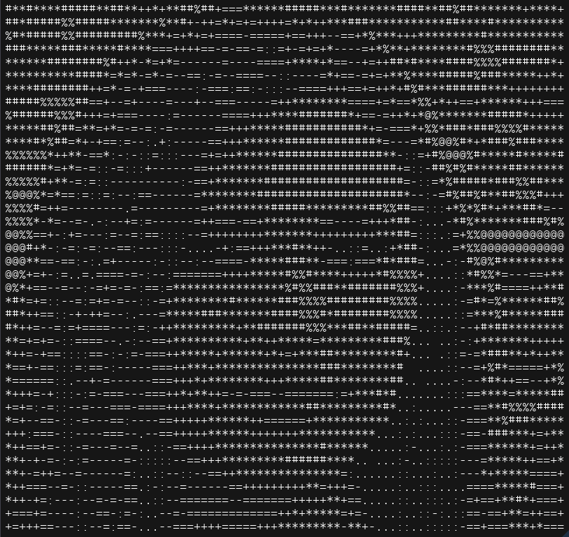
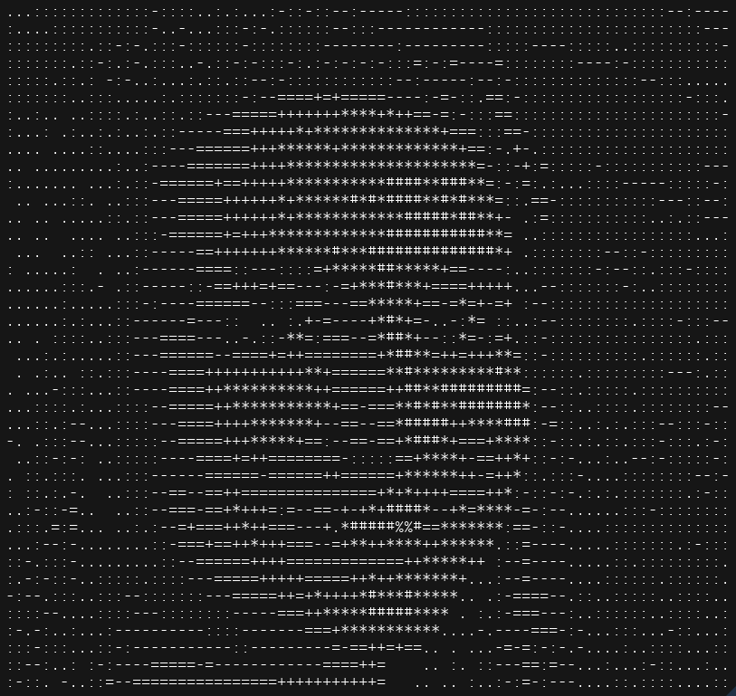

# Image to ascii

This is a small project aiming to convert a .jpg image to an image drawn with only ASCII characters.

---

- input -> output:

 

---

 

# References

- Based on this article: http://paulbourke.net/dataformats/asciiart/
- Sample pictures are downloaded from https://this-person-does-not-exist.com
- Show output image to display based on https://github.com/SpaiR/imgui-java (v1.86.3)